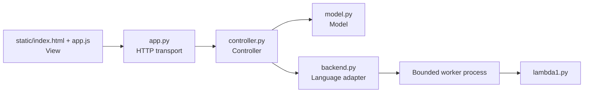
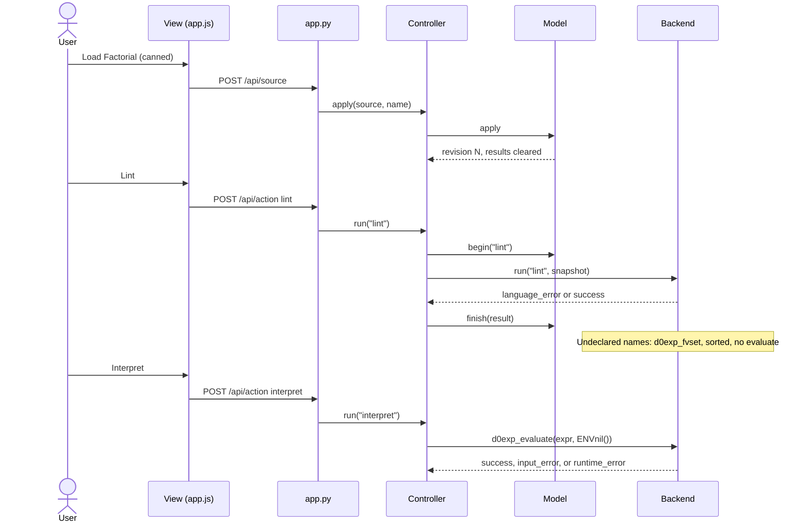

# Architecture

The controller, not the model, calls the language adapter. The model only owns state and preconditions; the controller snapshots applied source, invokes `Backend.run` outside its lock, and records the result. The view never calls `lambda1.py`.

| Responsibility | Implementation |
| --- | --- |
| Model | `model.py` `Model`: applied source, name, revision, results, busy flag, generated-code artifact; `apply` / `begin` / `finish` enforce idle, nonempty, size, and Execute preconditions |
| View | `static/index.html`, `style.css`, `app.js`: source menu, editor draft, Apply/Discard, five action buttons, status text, literal `textContent` results; HTTP `fetch` to the API |
| Controller | `controller.py` `Controller.apply` / `run` / `state`: serialize updates, dispatch the backend, restore idle after success or failure |
| HTTP transport | `app.py` `Handler`: JSON bounds, static files, loopback bind; no language analysis |
| Language adapter | `backend.py` `read_source`, `perform`, `Backend.run`: restricted constructors, real lint/evaluate, placeholders, 3-second subprocess |

Opening `static/index.html` as a file uses a JavaScript port of the same adapter contract. That offline path is a fallback. The graded MVC path is `app.py` → controller → model → `backend.py` → `lambda1.py`.

## Load source → Lint → Interpret

Numbered trace, including an undeclared variable:

1. The view loads an example from `/api/examples` and posts it to `/api/source`.
2. The controller asks the model to apply it. Nonempty source within 65,536 UTF-8 bytes becomes a new revision; results and artifacts clear. Rejection leaves the previous applied source intact.
3. Lint posts `/api/action`. The model requires applied source and idle state, then sets busy. The controller snapshots source and calls the adapter outside the lock.
4. The worker builds a `d0exp` from validated AST nodes and calls `d0exp_fvset`. An empty `frozenset` is success. A nonempty set is a `language_error` with sorted names, without evaluation. For `D0Evar("x")` the text is `Undeclared variables: x`.
5. The controller stores `{operation, revision, outcome, text}` and clears busy. The view renders with `textContent`.
6. Interpret repeats the dispatch but calls `d0exp_evaluate(expr, ENVnil())`. Lint success is not required. A `D0V000()` sentinel, including inside a pair, is a runtime error, as is division by zero.

## Adapter contract

`Backend.run(operation, source)` returns `{outcome, text}`.

| outcome | Meaning |
| --- | --- |
| `success` | Lint found no free variables, or interpret returned a defined value |
| `input_error` | Invalid constructor syntax or arguments |
| `language_error` | Nonempty free-variable set |
| `runtime_error` | Evaluation failure or `D0V000` |
| `backend_error` | Worker crash or 3-second timeout |
| `not_implemented` | Type-check or Compile placeholder |

The controller stores `{operation, revision, outcome, text}`. Source cannot change while busy. Unexpected adapter exceptions become `backend_error` and leave source available for retry.

Execute is rejected at the model (`execute` requires an artifact) and disabled in the view. Type-check and Compile return `not_implemented` and never attach an artifact.

Intended future artifact: `{revision, format, payload, producer_version}`. A real compiler must return a validated artifact for the active revision. Execute must consume that artifact without recompiling. Source changes and failed compilation already clear `model.artifact`.

## Replacing placeholders

A type checker would replace the type-check branch of `perform` with analysis of the same `d0exp`. A compiler would replace the compile branch, produce the artifact above, and store it on the model. The controller would then pass that artifact to a separate bounded execute adapter. The view would still display ordinary result records.

## Decisions and tradeoffs

1. **Standard-library HTTP server and explicit modules.** Setup stays dependency-free and MVC files are visible. The cost is no sessions, no multi-user isolation, and in-memory state that dies with the process. That matches the local single-user brief.

2. **Controller-owned backend calls plus a subprocess worker.** Bounds (3s wall clock; on Unix, CPU and 256 MiB address space) protect the server, and a fake backend can be injected in tests without touching the view. The cost is process startup latency. Browser drafts avoid per-keystroke HTTP, but unapplied text is tab-local and lost on refresh if the user ignores the warning.
